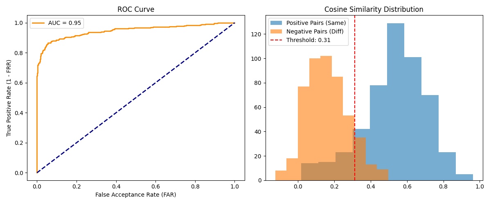

# Scalable Face Recognition Pipeline

This project implements a complete, multi-stage facial recognition pipeline benchmarked on the Labeled Faces in the Wild (LFW) academic dataset. The system is designed with a modular, multi-environment architecture to handle conflicting dependencies between deep learning libraries, demonstrating a robust MLOps approach.

The pipeline performs face detection, alignment, feature extraction into 512-dimensional vectors, and similarity analysis, culminating in a statistical evaluation of the system's performance using metrics like ROC curves and Equal Error Rate (EER).



## Core Logic
The pipeline follows a standard, industry-grade architecture for face recognition:
1.  **Face Detection & Alignment:** Identifies human faces in raw images (using MTCNN) and normalizes them by aligning the eyes to a horizontal axis and cropping the result.
2.  **Feature Extraction:** Converts each aligned 112x112 face into a 512-dimensional vector embedding using the pre-trained **ArcFace** model. This vector represents the unique mathematical features of the face.
3.  **Similarity Search:** Compares the embeddings of two faces using Cosine Similarity to generate a score indicating how likely they are to be the same person.
4.  **Statistical Evaluation:** Runs a large-scale test (1000+ pairs) to determine an optimal similarity threshold and calculate the system's accuracy (AUC) and Equal Error Rate (EER).

## Multi-Environment Architecture
This project uses three separate Python virtual environments to resolve dependency conflicts between `tensorflow`, `numpy`, and `insightface`/`deepface`. This modular approach ensures stability and mirrors microservice-based deployments in professional MLOps.

*   `env_detect`: Handles heavy deep learning for face detection (TensorFlow/MTCNN).
*   `env_extract`: Manages feature extraction with a strict dependency on `numpy<2` for compatibility with the ArcFace model wrappers.
*   `env_metrics`: Contains libraries for data processing, database indexing (FAISS), and statistical analysis.

---

## How to Run

### 1. Prerequisites
- Python 3.9+
- Git

### 2. Clone the Repository
```bash
git clone https://github.com/NafiS2/TSSOASSBATMAN.git
cd 
```

**Note:** The first time you run this script, it will take several minutes to download all the datasets and pre-trained models. The face detection step on 2000 images is computationally intensive and may take 5-10 minutes.

### 3. Setup


This project is modular, meaning you execute each stage of the pipeline independently using its own isolated Python environment. This ensures dependency stability and allows you to audit each step of the data flow.


**Step 0: Download and Prepare Dataset

This script downloads the LFW dataset and generates the test instruction file (test_pairs.csv).


python -m venv env_metrics
.\env_metrics\Scripts\activate
pip install -r requirements_metrics.txt
python 00_download_dataset.py
deactivate


**Step 1: Detect and Align

This script processes the raw images to detect faces, perform eye-alignment, and save the cropped output.


python -m venv env_detect
.\env_detect\Scripts\activate
pip install -r requirements_detect.txt
python 01_detect_and_align.py
deactivate


**Step 2: Extract Embeddings

This script converts the aligned faces into 512-dimensional vector embeddings using the ArcFace model.


python -m venv env_extract
.\env_extract\Scripts\activate
pip install -r requirements_extract.txt
python 02_extract_embeddings.py
deactivate


**Step 3: Build Vector Database

This step compiles the extracted embeddings into a searchable FAISS index.


.\env_metrics\Scripts\activate
python 03_build_vector_db.py


**Step 4: Run Similarity Tests

This script reads test_pairs.csv and calculates the cosine similarity for every pair, outputting the results into test_results.npy.


python 04_test_similarity.py


**Step 5: Evaluate Metrics

This final step reads the similarity scores, performs statistical calibration, calculates the Equal Error Rate (EER), and generates the ROC Curve.


python 05_evaluate_metrics.py
deactivate


## Project Structure
```
/
├── 00_download_dataset.py      # Downloads and prepares the LFW test set
├── 01_detect_and_align.py      # Script for Step 1
├── 02_extract_embeddings.py    # Script for Step 2
├── 03_build_vector_db.py       # (Not used in final test, but part of the architecture)
├── 04_test_similarity.py       # Script for Step 4
├── 05_evaluate_metrics.py      # Script for Step 5
│
├── requirements_detect.txt     # Dependencies for env_detect
├── requirements_extract.txt    # Dependencies for env_extract
├── requirements_metrics.txt    # Dependencies for env_metrics
│
|
│
└── data/                       # Holds all data artifacts
    ├── 1_raw_images/           # LFW images are downloaded here
    ├── 2_aligned_faces/        # Output of Step 1
    ├── 3_embeddings/           # Output of Step 2
    ├── test_pairs.csv          # Master list of comparison pairs
    └── final_evaluation_report.png # The final output graph
```
